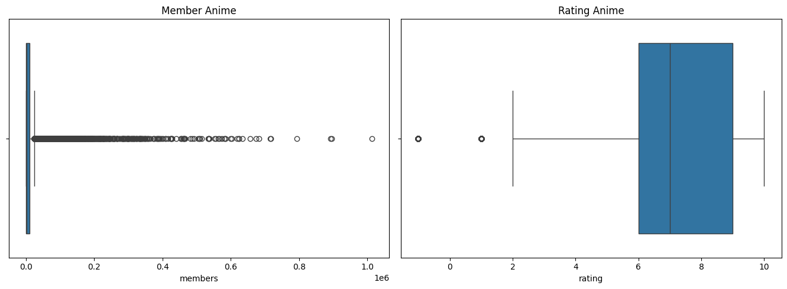
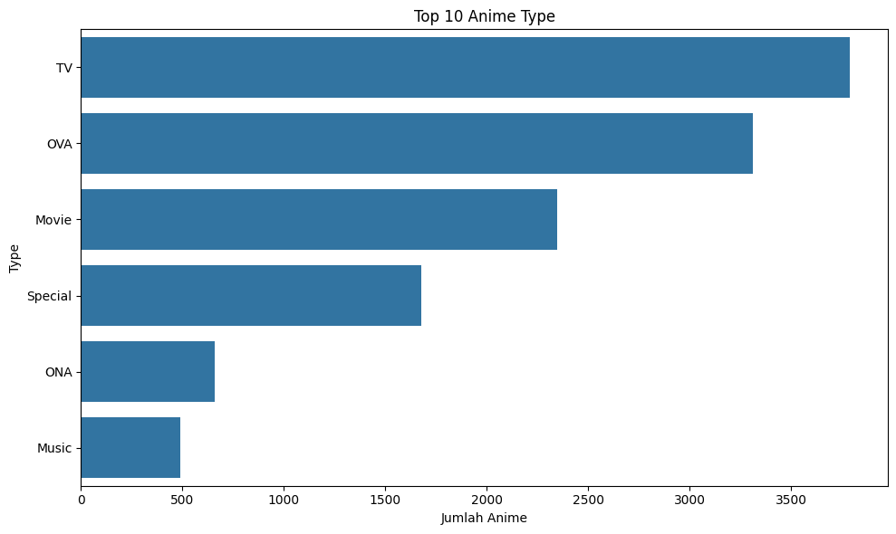
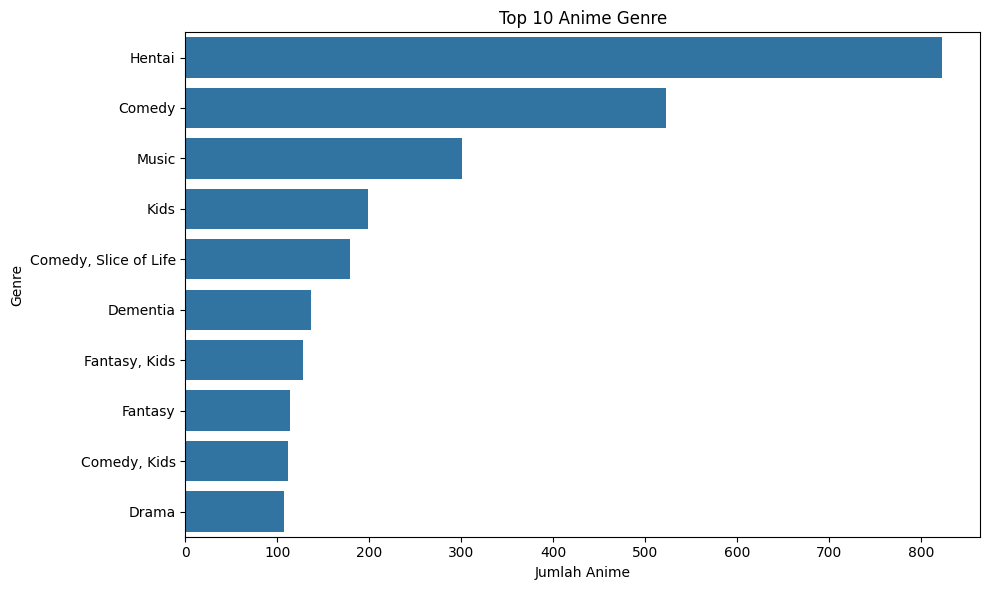
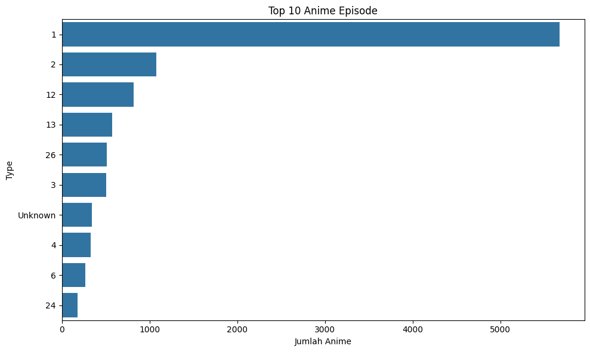
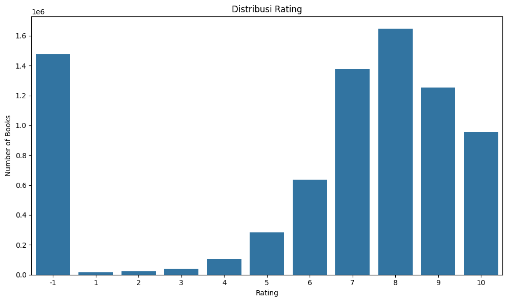
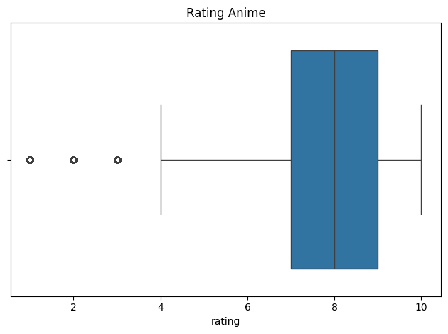
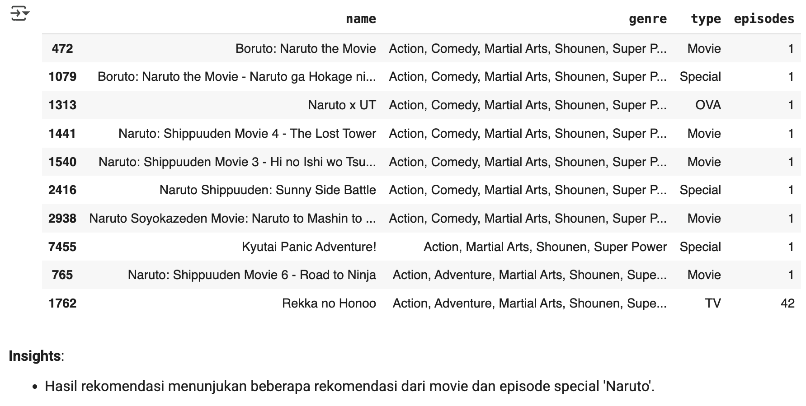
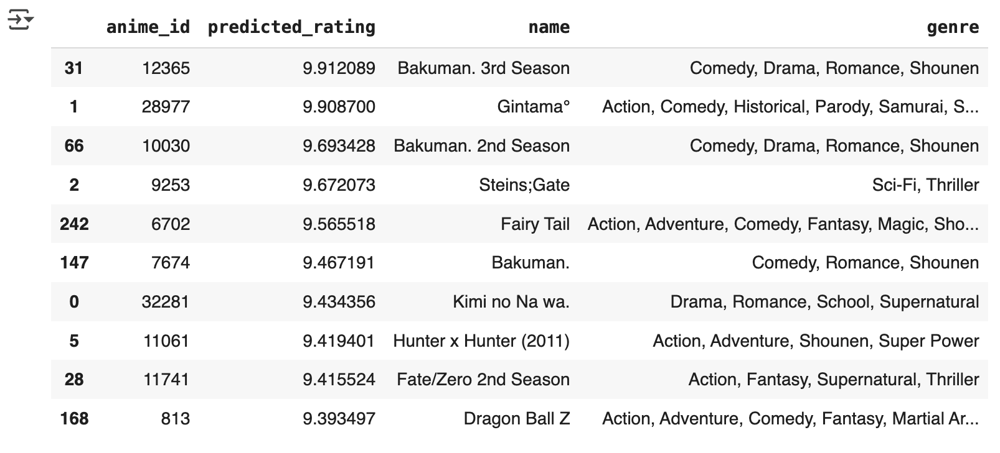

# 🚀 Hybrid Recommendation Engine: Content-Based & Collaborative Filtering

**Author:** Fatwa Nurhidayat  
**Focus:** Exploratory Data Analysis (EDA), Machine Learning, Predictive Analytics, and Large-Scale Data Processing.

---

## 📊 Project Overview

**Background** 
In today's digital era, streaming platforms and content aggregators like *MyAnimeList* provide access to thousands of titles globally. However, as the volume of available content grows exponentially, users frequently experience choice overload, making it difficult to discover new content that aligns with their personal preferences. This highlights the critical role of recommendation systems in filtering vast amounts of information and delivering highly relevant, personalized content suggestions.

This project develops a robust recommendation engine utilizing two prominent approaches: *Content-Based Filtering* and *Collaborative Filtering*. For the **Content-Based Filtering** approach, the system recommends anime based on content similarity, such as genres, episodes, or types. This project employs the **TF-IDF (Term Frequency-Inverse Document Frequency)** technique to transform textual data into weighted numerical representations. To efficiently identify the most similar anime based on content, the system integrates **FAISS (Facebook AI Similarity Search)**. By calculating similarities using Euclidean distance, FAISS enables the model to generate highly relevant recommendations based on item characteristics.

Complementing this, the project implements **Collaborative Filtering** to leverage user interaction data—such as historical ratings. Using the **Singular Value Decomposition (SVD)** algorithm, a matrix factorization method, the system maps both users and items into a latent feature space. By learning the hidden relationships between users and items, the SVD model can accurately predict ratings for unwatched anime, generating deeply personalized recommendations.

A study by **Prakash et al. (2022)** demonstrated that integrating these techniques significantly enhances the accuracy and efficiency of anime recommendation systems, particularly when addressing data sparsity and missing values.

**Strategic Impact & Business Value**
- **Personalized User Experience:** Delivering highly relevant recommendations to increase user engagement and satisfaction.
- **Efficient Content Discovery:** Reducing user exploration time by proactively suggesting relevant titles without manual browsing.
- **Real-World Data Implementation:** Providing a practical machine learning implementation using real-world public data, encompassing user ratings, explicit feedback, and rich metadata.
- **Algorithmic Evaluation:** Offering comprehensive insights into the strengths and limitations of content-based versus collaborative filtering approaches.

**References** 
Prakash, V., Raghav, S., Sood, S., Pandey, M., & Arora, M. (2022). Deep anime recommendation system: Recommending anime using collaborative and content-based filtering. *2022 4th International Conference on Advances in Computing, Communication Control and Networking (ICAC3N)*. https://doi.org/10.1109/ICAC3N56670.2022.10074101

---

## 🎯 Business Understanding

**Problem Statements**
1. **Information Overload & The Cold-Start Problem:** The massive growth of catalogs triggers choice overload. This risks lowering user engagement, particularly for new users with no interaction history (the *cold-start* problem).
2. **Lack of Deep Personalization:** Conventional recommendation systems often focus on trending items or macro-level genres, failing to deliver a hyper-personalized experience based on deep individual preferences.
3. **Underutilized Data Assets:** Valuable large-scale data assets—such as content metadata and behavioral interaction patterns—are often not optimally leveraged to extract actionable insights.

**Business Goals**
1. **Enhance User Engagement:** Develop an accurate and efficient recommendation engine to streamline content discovery, ultimately boosting user retention and accommodating new users.
2. **Drive Hyper-Personalization:** Create a deeply personal viewing experience by combining content attribute analysis with the exploration of global community behavioral patterns.
3. **Optimize Data Assets via Machine Learning:** Maximize the utilization of millions of data points into predictive models capable of delivering precise recommendations.

**Solution Statements**
1. **Content-Based Filtering (TF-IDF & FAISS):** Focuses on Natural Language Processing (NLP) from item metadata. **TF-IDF** transforms textual attributes (genres) into weighted numerical vectors. To ensure scalability, **FAISS** is implemented for blazing-fast similarity search using Euclidean (L2) distance. This architecture directly resolves the cold-start problem by recommending items based on content proximity.
2. **Collaborative Filtering (SVD):** Employs the **Singular Value Decomposition (SVD)** matrix factorization algorithm to process a large-scale interaction matrix. SVD maps users and items into a latent feature space, acting as an analytical predictor capable of accurately estimating the rating a user might give to unwatched content based on overarching global community trends.

---

## 🔍 Data Understanding

**Dataset Description**
The dataset encompasses comprehensive anime metadata alongside user preference logs, including explicit ratings and viewing histories from over 73,000 unique users on MyAnimeList. This large-scale dataset serves as the foundational data source for architecting a robust recommendation engine.

### **Dataset Overview**
- **Files**: 2 (`anime.csv` and `rating.csv`)
- **Total Items (Anime)**: 12,294 unique titles
- **Total Users**: 73,516 unique users
- **Data Source**: [Anime Recommendations Database](https://www.kaggle.com/datasets/CooperUnion/anime-recommendations-database)

### **Data Dictionary**

#### `anime.csv` (Content Metadata)
| Feature | Description |
|---|---|
| `anime_id` | Unique identifier for each anime title. |
| `name` | Full title of the anime. |
| `genre` | Comma-separated list of genres. |
| `type` | Broadcast format or media type (e.g., TV, Movie). |
| `episodes` | Total number of episodes. |
| `rating` | Average community rating (scale 1–10). |
| `members` | Total community members who bookmarked the anime. |

#### `rating.csv` (User Interaction Logs)
| Feature | Description |
|---|---|
| `user_id` | Anonymized unique identifier for the user. |
| `anime_id` | Identifier of the anime rated by the user. |
| `rating` | Explicit rating given by the user (scale 1–10). A value of `-1` indicates an implicit interaction (watched but not rated). |

### **Exploratory Data Analysis (EDA) & Data Quality Assessment**

- **Data Ingestion:** `anime.csv` (12,294 rows × 7 columns) and `rating.csv` (7,813,737 rows × 3 columns).
- **Missing Values:** `anime.csv` contained minimal missing values (`genre = 62`, `type = 25`, `rating = 230`).
- **Duplicates:** `rating.csv` contained exactly 1 duplicate record.

### **Visualization & Profiling Insights**

**Distribution & Outlier Analysis (Boxplot)**
- **Community Engagement (`members`):** Exhibits extreme positive skewness and massive variance, representing highly viral mainstream anime titles.
- **User Rating Behavior (`rating`):** Outliers at the `-1` value clearly indicate a massive volume of implicit interactions (content watched but not explicitly rated).

**Categorical & Feature Distribution Analysis**
- **Broadcast Format (`type`):** The 'TV' format (episodic series) heavily dominates the catalog.

- **Genre Popularity:** Distribution analysis highlights 'Hentai' and 'Comedy' as the most frequently tagged genres.

- **Episode Count (`episodes`):** Skewed toward single-episode titles due to non-TV formats like OVA, Movie, Special, and ONA.

- **User Sentiment:** The community is highly active, with explicit ratings concentrated tightly around 8, while a significant spike at `-1` confirms the presence of unwatched/unrated statuses.

---

## 🛠 Data Preparation Pipeline

### **Data Preparation Workflow**
- **Feature Selection:** Removing irrelevant features that lack predictive power or introduce severe outlier bias.
- **Handling Missing Values:** Purging incomplete records from `anime.csv`.
- **Data Deduplication:** Purging duplicates from `rating.csv`.
- **Outlier Management:** Filtering out unrated interaction logs (`-1`) to focus strictly on explicit user feedback.
- **Data Integration:** Merging the cleaned datasets based on `anime_id`.
- **Pre-processing for Modeling:** Structuring the dataset for TF-IDF/FAISS and SVD algorithms.

### **Data Cleaning Execution**
- **Feature Selection:** The `rating` and `members` features in `anime.csv` were dropped to reduce noise and redundant aggregation.
- **Missing Values & Duplicates:** Rows with NaNs (62 genres, 25 types) and 1 duplicate row were successfully removed.
- **Outlier Management (Implicit Data Filtering):** Outliers related to `members` were resolved by feature removal. For the `rating` feature, implicit feedback (`-1`) was filtered out, strictly retaining ratings > 0 (explicit feedback) as valid inputs for the recommender system.

### **Pre-processing for Modeling**

**1. Content-Based Filtering (TF-IDF & FAISS)**
1. Typecasting `anime_id` to object format to prevent numerical operations on categorical IDs.
2. Removing duplicate titles and genres to ensure unique content representations.
3. Feature Extraction: Applying `TfidfVectorizer(max_features=100)` to the `genre` column.
4. Array typecasting to `float32` (A strict computational requirement for FAISS).
5. Initializing and building the `faiss.IndexFlatL2(d)` for high-speed similarity search.

**2. Collaborative Filtering (SVD)**
1. Defining the explicit rating scale (1 to 10) using the Surprise `Reader` class.
2. Loading the unified dataframe into the specialized Surprise dataset format.
3. Performing a Train-Test Split (80% / 20%) to rigorously evaluate model performance on unseen data.

---

## 🤖 Modeling & Inference

### **1. Content-Based Filtering (TF-IDF & FAISS)**
This paradigm suggests items based on metadata proximity rather than relying on behavioral patterns of the broader community. By transforming categorical text (genres) into computable numerical formats using **TF-IDF**, the engine reflects the statistical importance of genres relative to the entire corpus. **FAISS** is utilized with an L2 (Euclidean) distance metric to execute blazing-fast nearest-neighbor searches in the high-dimensional vector space.

**Strengths (Pros):**
- **Cold-Start Resilience:** Highly effective for new users, operating independently of historical community data.
- **Interpretable Personalization:** Delivers transparent recommendations based on explicit content affinities.

**Limitations (Cons):**
- **Filter Bubble Effect:** Struggles to recommend diverse items outside established historical preferences, limiting serendipity.
- **Metadata Dependency:** Highly dependent on the completeness of catalog metadata.

**Model Inference Output Example:**
The inference execution successfully retrieved highly relevant semantic matches based on the input features.

### **2. Collaborative Filtering (SVD)**
This model-based approach leverages user interaction data (explicit ratings) to identify underlying patterns of shared preferences. **Singular Value Decomposition (SVD)** factorizes the massive user-item interaction matrix into lower-dimensional latent feature representations. It constructs a robust predictive model capable of estimating the exact rating a user might assign to a previously unseen item.

**Strengths (Pros):**
- **Latent Pattern Recognition:** Captures complex, hidden relationships between users and items.
- **Sparsity Robustness:** Outperforms memory-based models when dealing with highly sparse datasets.
- **High Predictive Accuracy:** Generates highly precise rating estimations.

**Limitations (Cons):**
- **Cold-Start Vulnerability:** Inherently struggles to recommend items to brand-new users lacking historical data.
- **Computational Complexity:** Requires rigorous model training and hyperparameter optimization compared to simple heuristic methods.

**Model Inference Output Example:**

---

## 📈 Evaluation Metrics & Business Impact

### **1. Content-Based Filtering: Precision@K**
**Precision@K** is a fundamental evaluation metric used to quantify the absolute relevance of the Top-K recommendations generated by the system. It effectively measures how successfully the system retrieves highly personalized items matching the user's established preferences.

**Precision@K Formula:**

$$
\text{Precision@K} = \frac{\text{Relevant Items in Top-K}}{K}
$$

**Analytical Insight:**
- The TF-IDF model achieved a **perfect Precision score of 1.00 (100%)**. This confirms that out of the 10 anime titles recommended by the engine, every single item was strictly accurate and semantically relevant to the input's characteristics.

### **2. Collaborative Filtering: Root Mean Square Error (RMSE)**
**RMSE** is an industry-standard metric used to measure the predictive accuracy of a machine learning model by calculating the standard deviation of the prediction errors (residuals) between the model's predicted ratings and the actual ground-truth ratings provided by users.

**RMSE Formula:**

$$
\text{RMSE} = \sqrt{ \frac{1}{N} \sum_{i=1}^{N} (\hat{r}_i - r_i)^2 }
$$

**Analytical Insight:**
- The SVD model yielded an **RMSE of 1.1335**. Considering the explicit rating scale ranges from 1 to 10, this metric demonstrates a **highly robust predictive capability**. It signifies that the model's predictions deviate by an average margin of less than 1.5 points, proving its absolute reliability in accurately anticipating complex user preferences and extracting actionable insights from large-scale datasets.

*Developed by Fatwa Nurhidayat as part of an advanced Machine Learning implementation to demonstrate proficiency in handling large-scale datasets, data mining, and building predictive analytics solutions.*
